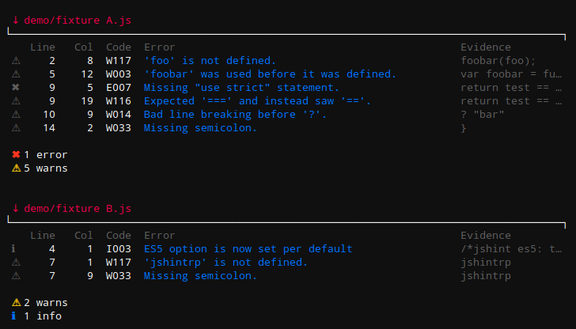
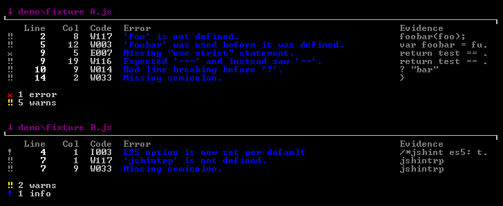

# jshint-smart [](https://travis-ci.org/s4tori/jshint-smart)

> Responsive reporter for [JSHint](https://github.com/jshint/jshint)


## Example

On Linux :



On Windows :



The column "Code" will be displayed only if you run JSHint with a flag --verbose.<br />
The column "Evidence"  will be displayed only if there is enough space.


## Install

```bash
$ npm install --save-dev jshint-smart
```


## Usage

### [grunt-contrib-jshint](https://github.com/gruntjs/grunt-contrib-jshint)

```js
grunt.initConfig({
    jshint: {
		options: {
			reporter: require("jshint-smart"),
			verbose: false, // if true : show warning code
		},
		target: ["file.js"]
	}
});

grunt.loadNpmTasks("grunt-contrib-jshint");
grunt.registerTask("default", ["jshint"]);
```

### [gulp-jshint](https://github.com/wearefractal/gulp-jshint)

```js
gulp.task("jshint", function () {
	return gulp.src(["file.js"])
		.pipe(jshint())
		.pipe(jshint.reporter("jshint-smart", { verbose: false })) // if true  : show warning code
		.pipe(jshint.reporter("fail"));                            // optional : fail when a JSHint error happens
});

gulp.task("default", ["jshint"]);
```

### [JSHint CLI](https://github.com/jshint/jshint/)

```
jshint file.js --reporter=./node_modules/jshint-smart/lib/jshint-smart.js
```
